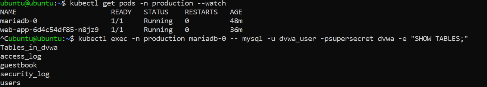
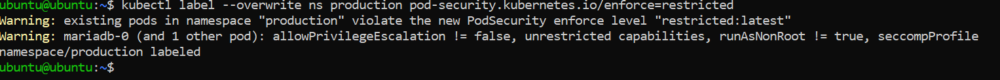
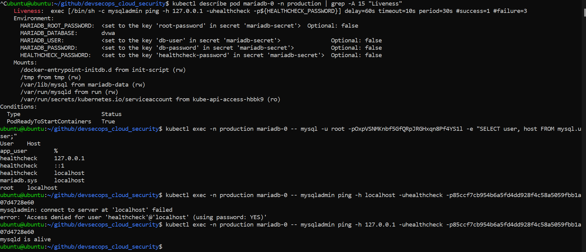
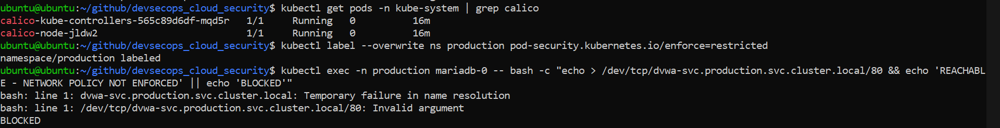
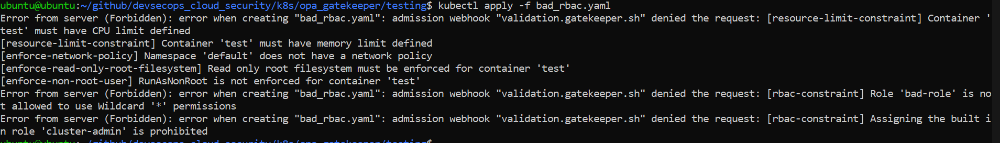
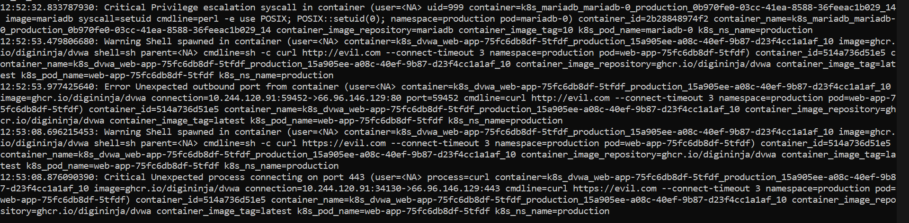
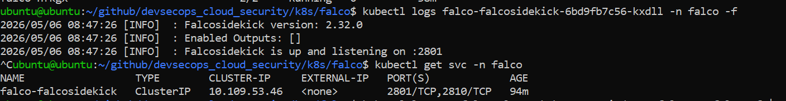
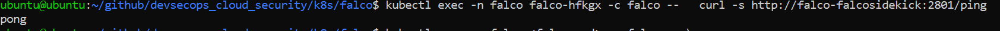

# Defense-in-Depth Cloud Security Architecture: Securing Cloud-Native Applications with Integrated Kubernetes, CI/CD, and AWS Controls
Defense-in-depth security for cloud-native applications on AWS EKS covering threat modelling, IaC scanning, Kubernetes hardening, container security, supply chain security, observability, and runtime threat detection.

---

## Table of Content

- [Project Overview](#-project-overview)
- [Threat Modelling](#-threat-modelling)
- [Phase 1: Local Foundation (Minikube)](#-phase-1-local-foundation-(minikube))
- [Phase 2: AWS Foundation](#-aws-foundation)
- [Phase 3: Security Pipeline and Supply Chain](#-phase-3-security-pipeline-and-supply-chain)
- [Phase 4: AWS Security Services](#-phase-4-aws-security-services)
- [Phase 5: Observability and Detection on AWS](#-phase-5-observability-and-detection-on-aws)
- [Phase 6: Testing and Validation](#-phase-6-testing-and-validation)

---

## Project Overview 
In this project, I will implement a defense-indepth security architecture for cloud-native applications across six phases; from threat modelling to local Kubernetes foundations through to production level deployment on AWS with automated threat detection and response. I will be using DVWA as the application and MariaDB as the database.

- **Threat Modelling**

This models the architecture, defines trust boundaries, Identifies threats applicable to the system, there impact, severity, and likelihood using STRIDE and DREAD framework, and determines the suitable mitigations which serves as the guide for my implementations **which is subject to change as I progress**.

- **Phase 1:Local Foundation (Minikube); In progress**

Implement and validate the neccessary security controls on minikube before provisioning any AWS resources. This covers baseline application deployment and connectivity testing, GPG signed commits and Pull Request enforcement on main branch, container security, Kubernetes security hardening, Network Policy and RBAC, OPA Gatekeeper policy enforcement with Rego, Falco runtime threat detection, Vault secrets management, observability stack, and Cosign image signing.

- **Phase 2: AWS Foundation**
  
- **Phase 3 — Security Pipeline and Supply Chain**
  
- **Phase 4 — AWS Security Services**
  
- **Phase 5 — Observability and Detection on AWS**
  
- **Phase 6 — Testing and Validation**

## Threat modelling

In order to fully understand the whole security architecture, I did threat modeling first, with that I could model every component including actors, data flows, processes, and data stores. This is important because it helps me understand what I’m building, what can go wrong, and how it can be mitigated which drives every architectural decision. This is a shift left security because it identifies and mitigates threats at design time rather than discovering them after deployment.

In this architecture I implemented a multi-environment deployment through Terraform workspaces. Due to cost constraints, the dev and production workspaces will not run silmutaneously. I will validate infrastructure changes in the dev workspace first, then promote to production using Terraform apply with a manual approval gate before destroying the dev workspace. This will ensure no untested or unreviewed infrastructure change reaches production directly. 

This threat model covers 47 threats across all six STRIDE categories applicable to this architecture. I applied DREAD scoring for risk quantification and NIST CSF mapping for compliance alignment. I did a risk analysis with mitigated risks, residual risks and accepted gaps documented.

### Threat Model Summary

| ID | Component | STRIDE | DREAD | Risk | Threat Summary | Key Controls |
|----|-----------|--------|-------|------|----------------|--------------|
| T4 | User HTTP Traffic | Tampering | 23 | CRITICAL | SQL injection and XSS payloads in HTTP requests | AWS WAF, PSA Restricted, OPA Gatekeeper |
| T1 | Internet User | Spoofing | 22 | CRITICAL | Authentication bypass using SQL injection or credential stuffing | AWS WAF rate limiting, TLS 1.3 |
| T23 | DVWA Pod | Elevation of Privilege | 17 | HIGH | Container escape through runtime vulnerability | PSA Restricted, Falco, Falco Sidekick |
| T9 | CI/CD Pipeline | Tampering | 18 | HIGH | Malicious workflow pushed directly to main branch | GPG signed commits, Checkov, Cosign |
| T30 | EKS API Server | Elevation of Privilege | 17 | HIGH | Service account exploits Kubernetes CVE to gain cluster-admin | RBAC, OPA Gatekeeper, GuardDuty |
| T45 | EC2 IMDS | Elevation of Privilege | 17 | HIGH | Container escape queries IMDS for node IAM credentials | IMDSv2, node least privilege, Falco |
| T14 | SSM Session Manager | Tampering | 17 | HIGH | Valid SSM access used to disable Falco or alter node state | IAM condition keys, keystroke logging, Falco |
| T7 | Pod-to-Pod Traffic | Tampering | 13 | MEDIUM | Compromised DVWA pod sends malicious queries to drop tables or escalate database privileges | NetworkPolicy default-deny, database privilege restriction, TLS 1.3 |
| T12 | Pod-to-AWS API (IRSA) | Information Disclosure | 15 | MEDIUM | IRSA token stolen from pod filesystem and used outside the cluster to access AWS resources | IRSA token expiry, VPC CIDR-scoped trust policy, CloudTrail, Falco |
| T37 | Vault | Information Disclosure | 17 | HIGH | Vault storage backend compromise reveals all stored secrets in plaintext | KMS auto-unseal, AES-256-GCM encryption, TLS 1.3, path-scoped policies |

*For a detailed insight on the complete threat model with DREAD scoring, risk matrix and risk posture summary, view in the Google Sheet below.*

[View Threat Model in Google Sheet](https://docs.google.com/spreadsheets/d/1aVw7FQazMh0S7U9Myd2VGUARhMJFIJVE/view?usp=sharing)

## Phase 1: Local Foundation (Minikube)

In this phase, I started with Minikube because I wanted to test and validate all security controls that are possible locally without the pressure of cloud costs. I installed the necessary tools on a Ubuntu 24.04 VirtualBox VM, created a GitHub repository, cloned it locally, and configured GPG signed commits with branch protection on main. This partly addresses the threat of an attacker with access to the repository through compromised GitHub credentials pushing a malicious workflow file directly to main by ensuring that every change to the repository requires a GPG-signed commit and a pull request, providing cryptographic proof of authorship and preventing direct pushes to main branch.

I then created Kubernetes manifests for DVWA and MariaDB, verified connectivity, and confirmed the application was working before adding any security controls. 



I deliberately deployed both pods in the same **"production"** namespace because they are web and database tiers of the same application; same team, same lifecycle, same deployment. I also mitigated the potential risk of co-locating them in subsequent stages by enforcing **RBAC** which gives each pod a **dedicated ServiceAccount** with empty roles so that neither pods can call the Kubernetes API or interact with the other's resources, and configured NetworkPolicy that enforces default-deny in the namespace with an explicit allow rule permitting **ONLY** DVWA to reach MariaDB on port 3306 an no other pod-to-pod traffic is permitted.

Here are the links to the complete manifest for both pods:

[DVWA Manifest](k8s/apps/dvwa.yaml)
[MariaDB Manifest](k8s/apps/mariadb.yaml)

### Kubernetes restricted profile standard on the production namespace

To mitigate the risk of a container runtime vulnerability such as a runc CVE or dirty-pipe class exploit that can allow an attacker to escape the container and access the underlying EKS worker node or an attacker with Kubernetes API access modifying a running pod specification to inject privileged capabilities, mount the host filesystem, or insert malicious code, I enforced the Kubernetes restricted profile standard on the production namespace. 



*Kubernetes restricted profile enforced with the running pods flagged*

I then edited the pods to meet up to the standard and reapplied.

```yaml
securityContext:
  runAsNonRoot: true
  fsGroup: 999
  fsGroupChangePolicy: "OnRootMismatch"
containers:
  - name: mariadb
    image: mariadb:10
    securityContext:
      allowPrivilegeEscalation: false
      runAsUser: 999
      readOnlyRootFilesystem: true
      seccompProfile:
        type: RuntimeDefault
      capabilities:
        drop:
          - ALL
```


- *allowPrivilegeEscalation: false* this will prevent my container process from gaining more privileges than it started with.
  
- *capabilities drop ALL* to drop all linux capabilities which are granular units of root privilege so that non of the containers can perform privileged operations even while running as a non-root user.
  
- *runAsNonRoot: true* to block the container from running as root because if a root process inside a container escapes the container boundary and lands on the host as root, it gives the attacker immediate control of the node.

- *seccompProfile: RuntimeDefault* to apply the container runtime's default seccomp filter, which blocks dangerous Linux system calls that the containers have no legitimate reason to invoke.
  
- It also blocks privileged containers, hostPath mounts, hostNetwork, and hostPID.

Any pod that does not meet these requirements is rejected at admission.

### I Implemented extra kubernetes security controls

On top of what the restricted profile mandates, I implemented the following controls for defense-indepth

- runAsUser: 999 on MariaDB and runAsUser: 998 on DVWA. This will prevent permission errors and avoid any ambiguity about which user the process identity should resolve to.

- fsGroup: 999 on MariaDB with fsGroupChangePolicy: OnRootMismatch. The MariaDB will require exclusive ownership of its data directory. Without correct ownership, MariaDB will refuse to start because it cannot read or write its own data files. I configured this to allow Kubernetes set the PersistentVolume group ownership before the container starts, avoiding the need for CHOWN capability which is a privileged operation to fix permissions. *fsGroupChangePolicy: OnRootMismatch* ensures ownership is only changed if it does not already match to avoid unnecessary recursive permission operations on large volumes.

- readOnlyRootFilesystem: true on both pods. I mounted the container filesystem for both pods as read-only. This prevents a compromised container from writing malicious binaries, modifying application code, or staging exfiltrated data anywhere on its own filesystem outside of explicitly defined writable mounts. This directly reduces the blast radius if a compromise is successful, addressing the threats of an attacker escaping the container, or the database files being modified to inject backdoors or corrupt audit records.

- emptyDir volumes: The readOnlyRootFilesystem that I enabled required that I mount emptyDir volumes at every path the applications need to write to at runtime.

- Resource limits and requests on both pods: CPU and memory limits will prevent any single workload from exhausting the node resources, I also applied *[LimitRange](k8s/apps/limitrange.yaml)* on the production namespace as a safety net to enforce default resource requests and limits on any container that does not explicitly define them. These addresses the threat of a memory leak or deliberate resource bomb exhausting available node resources and causing pod evictions and service unavailability.

```yaml
    resources:
      requests:
        cpu: "200m"
        memory: "256Mi"
      limits:
        cpu: "400m"
        memory: "512Mi"
    volumeMounts:
      - name: dvwa-data
        mountPath: /tmp
      - name: apache-run
        mountPath: /var/run/apache2
      - name: dvwa-uploads
        mountPath: /var/www/html/hackable/uploads

volumes:
  - name: dvwa-data
    emptyDir: {}
  - name: apache-run
    emptyDir: {}
  - name: dvwa-uploads
    emptyDir: {}
```

-  Readiness and Liveness probes on both pods:
I configured readiness probes to ensure that the applications pods are ready before kubernetes starts sending in traffic, and liveness probes to detect when a container is running but is no longer responding to requests which will provide automated self healing for the pod by kubernetes restarting the pod. 

- On DVWA, I configured readiness probe on /login.php and liveness on /. This is because readiness */login.php* requires the full stack to be available (Apache, PHP, and the database connection), so traffic will not be sent to DVWA if MariaDB is unavailable. For liveness probe, I used / so that if MariaDB is temporarily unavailable, Kubernetes will not restart DVWA unnecessarily when Apache is healthy.
  
```yaml
readinessProbe:
  httpGet:
    path: /login.php
    port: 80
  initialDelaySeconds: 10
  periodSeconds: 10
  timeoutSeconds: 5
  failureThreshold: 3
livenessProbe:
  httpGet:
    path: /
    port: 80
  initialDelaySeconds: 60
  periodSeconds: 30
  timeoutSeconds: 10
  failureThreshold: 3
```
  
- For MariaDB, I configured exec probes that runs mysqladmin ping using the dedicated healthchecks. I created the dedicated healthcheck user using an init script mounted at /docker-entrypoint-initdb.d/. I generated a strong password using openssl rand number generator, stored the password in Kubernetes Secret and injected it through environment variable which is consistent with the no hardcoded secret security principle.

- I created a dedicated healtchcheck user rather than reusing the application credentials because coupling health check credentials to the application credentials means if the application password rotates, the probes will silently break leading to uneccessary restarts on the pod making the database appear unavailable. Also, a dedicated user with minimal privileges follows the priciple of least privilege and will limit what an attacker can access if they observe the probe command.
  
- I also implemented password requirement for the dedicated healthcheck user to mitigate lateral movement. Although the user is restricted to localhost, all containers in a pod share the same network namespace and therefore the same localhost. If I add a sidecar to the MariaDB pod in future, it would inherit localhost trust. Without a password, any process in the pod could connect to MariaDB as the healthcheck user with no barrier.

```yaml
readinessProbe:
  exec:
    command:
      - /bin/sh
      - -c
      - mysqladmin ping -h 127.0.0.1 -uhealthcheck -p${HEALTHCHECK_PASSWORD}
  initialDelaySeconds: 20
  periodSeconds: 10
  timeoutSeconds: 5
  failureThreshold: 3
livenessProbe:
  exec:
    command:
      - /bin/sh
      - -c
      - mysqladmin ping -h 127.0.0.1 -uhealthcheck -p${HEALTHCHECK_PASSWORD}
  initialDelaySeconds: 60
  periodSeconds: 30
  timeoutSeconds: 10
  failureThreshold: 3
```

- I configured the readiness and liveness probes for mariadb to use -h 127.0.0.1 rather than -h localhost. This is because when -h localhost is used, MariaDB connects via Unix socket and applies unix_socket authentication based on the Linux system user identity. Since the healthcheck database user is not the system user, authentication fails regardless of password. Using -h 127.0.0.1 forces TCP which always uses password authentication. I used the IDENTIFIED VIA mysql_native_password clause in the init script to ensure password authentication is used regardless of MariaDB's defaults.

- However this alone was not sufficient because MariaDB's internal mysql_secure_installation equivalent runs after the init script and resets the authentication plugin for local users to unix_socket which overrides the plugin set during user creation. I fixed this by using a *Heredoc file* for the init script in order to control the sequence, then I added an explicit ALTER USER statement in the init script which runs after mysql_secure_installation completes.

```yaml
apiVersion: v1
kind: ConfigMap
metadata:
  name: mariadb-init
  namespace: production
data:
  healthcheck.sh: |
    #!/bin/sh
    mysql -u root -p"${MARIADB_ROOT_PASSWORD}" <<EOF
    CREATE USER IF NOT EXISTS 'healthcheck'@'127.0.0.1' IDENTIFIED BY '${HEALTHCHECK_PASSWORD}';
    ALTER USER 'healthcheck'@'127.0.0.1' IDENTIFIED VIA mysql_native_password USING PASSWORD('${HEALTHCHECK_PASSWORD}');
    REVOKE ALL PRIVILEGES ON dvwa.* FROM '${MARIADB_USER}'@'%';
    GRANT SELECT, INSERT, UPDATE ON dvwa.* TO '${MARIADB_USER}'@'%';
    DROP USER IF EXISTS 'root'@'%';
    FLUSH PRIVILEGES;
    EOF
```

*MariaDB Liveness probe succesful with TCP Connection*

### Database privilege restriction 

By default MariaDB grants the application user full privileges on the database. I implemented an init script that revokes these and grants **ONLY** SELECT, INSERT, UPDATE permissions on the dvwa database user. This addresses the threat of a compromised DVWA pod sending malicious SQL queries attempting to drop tables, exfiltrate data, or escalate database privileges. I intentionally ommitted the DELETE permission because a compromised application pod with DELETE permission can delete users, wipe access logs, or destroy audit records. In production, DELETE operations such as log rotation would be handled by a dedicated maintenance database user triggered by a scheduled cron job, not available to the application at runtime. 

I restricted Root user to localhost only so that all database administration will require kubectl exec into the pod, which is logged on Kubernetes audit logs. This will prevent the risk of if port 3306 were ever accidentally exposed through a misconfigured NetworkPolicy or a cloud security group, an attacker cannot authenticate directly as root from outside the cluster.

### ConfigMap and manifest tampering
At this stage, anyone with kubectl write access to the production namespace can apply any manifest including creating or modifying ConfigMaps. The current control is Git branch protection with GPG-signed commits, Pod ServiceAccounts having zero API permissions. I intend to close the gap as well by applying Cosign and OPA Gatekeeper signature validation alongside IAM-scoped kubectl access.

### StatefulSet for MariaDB and Deployment for DVWA

I configured MariaDB as StatefulSet because it is a database that requires a PersistentVolume for the database files, the pod needs a stable and predictable identity so that the volume claim can always reattach to the correct pod on restart. A StatefulSet provides this stable identity and manages the PersistentVolumeClaim lifecycle. 
In contrast, I configured the DVWA pod as a Deployment because it is stateless and each replica is interchangeable, it can be replaced or rescheduled without the risk of a pod restarting with no guarantee of reattaching to the same volume, leaving data inaccessible.

### StorageClass volumeBindingMode: Immediate

I configured the StorageClass for MariaDB to use volumeBindingMode: Immediate instead of WaitForFirstConsumer because on Minikube's single-node setup, WaitForFirstConsumer creates a deadlock, the scheduler waits for a node placement decision before creating the volume, but the pod cannot be scheduled without the volume ready. Immediate provisions the volume as soon as the PVC is created. This will be changed to WaitForFirstConsumer on EKS so that the volume is created in the same availability zone as the scheduled pod, preventing zone mismatch failures.

### RBAC: Dedicated ServiceAccount per workload

I created dedicated [ServiceAccount](k8s/apps/rbac.yaml) per workload for dvwa and MariaDB with empty Roles granting zero Kubernetes API permissions because neither pod needs to call the Kubernetes API. The dedicated identity ensures that audit logs are recorded separately for each ServiceAccount, and permissions can be adjusted per workload independently without affecting the other. This directly addresses the threat of a stolen Kubernetes service account token being used to impersonate an administrator and perform unauthorised cluster operations, or a service account with limited permissions exploiting a Kubernetes vulnerability to escalate to cluster-admin. Because ServiceAccounts are mounted at the pod level, not the container level, every container in a pod inherits the same ServiceAccount token. If a pod had multiple containers with different trust levels, the less trusted container would inherit the same token as the more privileged one. 

I configured *automountServiceAccountToken: false* for both pods because even with the dedicated ServiceAccounts and empty roles, the token is still mounted into the pod filesystem by default. This means that if an attacker gains code execution inside DVWA or MariaDB, they can read that token and use it to authenticate to the Kubernetes API directly and be able to perform reconnaissance inside the cluster.

### NetworkPolicy with Calico CNI

I applied three [NetworkPolicy objects](k8s/apps/network_policy.yaml): 

- A default-deny policy that blocks all ingress and egress across the namespace

- A dvwa-np policy allowing ingress on port 80 from 0.0.0/0. DVWA is the web application and it needs to accept HTTP requests from users. In Minikube this is direct access via NodePort. On AWS, I will replace this with ingress only from the Application Load Balancer Security Group, removing direct internet access to the pod entirely and routing all traffic through WAF inspection first. I also allowed an egress to MariaDB **ONLY** on port 3306 and, egress to DNS on port 53 because without DNS egress, name resolution will fail and DVWA cannot locate the database regardless of whether the connection itself would be permitted.

- mariadb-np to allow ingress from DVWA **ONLY** on port 3306 and **ONLY** from pods labelled app=dvwa.

The network policies by isolating the database traffic to only dvwa, addresses the threat of an unencrypted database connection revealing passwords or query content to a malicious pod on the same node. By denying all egress except for DNS and MariaDB, the network policy with the RBAC configuration of minimal role service accounts, address the threat of a stolen service account token being used to call the Kubernetes API server from inside a pod.

Minikube's default CNI does not enforce NetworkPolicy so I restarted minikube with Calico to enable enforcement. I Verified before and after: without Calico, MariaDB could reach DVWA. With Calico, the same connection is blocked, proving the policies are enforced.


*Network policy enforced*


### NetworkPolicy label spoofing
The Network Policies select pods by label, this means that any pod created in the production namespace with a matching label will inherit the same network access rules including egress to MariaDB on port 3306. The current control is RBAC for both pod ServiceAccounts have zero API permissions, so an attacker cannot create malicious pods from a compromised container through the Kubernetes API using its own token but someone with kubectl access can. This is a gap at this stage which I will mitigate in future stages with Cosign image signing and OPA Gatekeeper admission constraint that will validate the signatures and enforce blocking of any pod with an unsigned image regardless of what labels it carries.


### OPA Gatekeeper Policy with Rego

I installed OPA Gatekeeper, wrote custom ConstraintTemplates using Rego for the kubernetes security controls I enforced, this serves as a second layer of control acting at the admission level. I configured all ConstraintTemplates to target both naked Pods and controller resources so that every resource is intercepted irrespective of how it is applied. 

- **[EnforceNonRootUser](k8s/opa_gatekeeper/01-templates/enforce_non_root.yaml)** 

```yaml
  targets:
    - target: admission.k8s.gatekeeper.sh
      rego: |
        package enforcenonrootuser
        violation[{"msg": msg}] {
          pod_spec := get_pod_spec(input.review.object)
          container := pod_spec.containers[_]
          not container.securityContext.runAsNonRoot == true
          not pod_spec.securityContext.runAsNonRoot == true
          msg := sprintf("RunAsNonRoot is not enforced for container '%v'", [container.name])
        }

        violation[{"msg": msg}] {
          pod_spec := get_pod_spec(input.review.object)
          container := pod_spec.containers[_]
          container.securityContext.runAsNonRoot == false
          msg := sprintf("RunAsNonRoot is overridden for container '%v'", [container.name])
        }

        violation[{"msg": msg}] {
          pod_spec := get_pod_spec(input.review.object)
          container := pod_spec.containers[_]
          container.securityContext.runAsUser == 0
          msg := sprintf("Container '%v' must not run as user 0", [container.name])
        }

        violation[{"msg": msg}] {
          pod_spec := get_pod_spec(input.review.object)
          pod_spec.securityContext.runAsUser == 0
          msg := "Run as user 0 is prohibited"
        }

        get_pod_spec(obj) = spec {
          obj.kind == "Pod"
          spec := obj.spec
        }

        get_pod_spec(obj) = spec {
          spec := obj.spec.template.spec
        }
```
The first block catches when run as non root is not enforced either at the pod or container level. The second block catches when the container level tries to override run as non root user enforced at the pod level. The third and fourth blocks will catch when UID of 0 is explicitly assigned to either the pod or container.

 **[See Constraint](k8s/opa_gatekeeper/02-constraints/runasnonroot_constraint.yaml)**

- **[RequireResourceLimits](k8s/opa_gatekeeper/01-templates/require_resource_limits.yaml)**: **[See Constraint](k8s/opa_gatekeeper/02-constraints/require_resource_limits_constraint.yaml)**

- **[DenyPrivilegedContainer](k8s/opa_gatekeeper/01-templates/deny_privileged_containers.yaml)**; **[See Constraint](k8s/opa_gatekeeper/02-constraints/deny_privileged_containers_constraint.yaml)**

- **[EnforceReadOnlyRootFilesystem](k8s/opa_gatekeeper/01-templates/read_only_root_fs.yaml)** **[See Constraint](k8s/opa_gatekeeper/02-constraints/readonly_root_fs_constraint.yaml)**

- **[BlockLatestImageTag](k8s/opa_gatekeeper/01-templates/block_latest_image.yaml)**: I scoped this to production namespace only so as to prevent applications from automatically pulling a new image on pod restart which could introduce untested changes without a deployment pipeline. However a developer may need to legitimately use kubectl run without specifying a tag for quick testing. By scoping this constraint to production namespace, it preserves workflow flexibility outside production while enforcing stability where it matters. **[See Constraint](k8s/opa_gatekeeper/02-constraints/block_latest_image_constraint.yaml)**

- **[EnforceRBACServiceAccount](k8s/opa_gatekeeper/01-templates/enforce_rbac_service_account.yaml)**: I configured four violation blocks that targets Pods, Roles, ClusterRoles, RoleBindings and ClusterRoleBindings. Blocks 1 and 2 ensure that every resource has a dedicated ServiceAccount that is not the default service account, addressing the threat of a compromised pod inheriting excessive API permissions through the default account (even if someone grants an excessive permission to the default account). Block 3 blocks RoleBindings/ClusterRoleBindings that grant cluster-admin, admin or edit roles which are dangerous built-in roles that grant broader permissions than any application workload will require. Block 4 blocks wildcard permissions on Role/ClusterRole verbs, resources and apiGroups because a wildcard on any single dimension can grant excessive permissions regardless of what the others restrict.

```yaml
targets:
  - target: admission.k8s.gatekeeper.sh
    rego: |
      package enforcerbacserviceaccount
      violation[{"msg": msg}] {
        pod_spec := get_pod_spec(input.review.object)
        pod := object.get(input.review.object.metadata, "name", input.review.object.metadata.generateName)
        not pod_spec.serviceAccountName
        msg := sprintf("Service account is not configured for pod '%v'", [pod])
      }

      violation[{"msg": msg}] {
        pod_spec := get_pod_spec(input.review.object)
        pod := object.get(input.review.object.metadata, "name", input.review.object.metadata.generateName)
        pod_spec.serviceAccountName == "default"
        msg := sprintf("Default service account is not allowed for pod '%v'", [pod])
      }

      violation[{"msg": msg}] {
        kinds := {"RoleBinding", "ClusterRoleBinding"}
        kinds[input.review.kind.kind]
        forbidden_roles := {"cluster-admin", "admin", "edit"}
        role_name := input.review.object.roleRef.name
        forbidden_roles[role_name]
        msg := sprintf("Assigning the built in role '%v' is prohibited", [role_name])
      }

      violation[{"msg": msg}] {
        kinds := {"Role", "ClusterRole"}
        kinds[input.review.kind.kind]
        rule := input.review.object.rules[_]
        wildcard(rule)
        msg := sprintf("Role '%v' is not allowed to use Wildcard '*' permissions", [input.review.object.metadata.name])
      }

      wildcard(rule) { rule.verbs[_] == "*" }
        wildcard(rule) { rule.resources[_] == "*" }
        wildcard(rule) { rule.apiGroups[_] == "*" }

        get_pod_spec(obj) = spec {
          obj.kind == "Pod"
          spec := obj.spec
        }

        get_pod_spec(obj) = spec {
          spec := obj.spec.template.spec
        }

```
  **[See Constraint](k8s/opa_gatekeeper/02-constraints/rbac_service_account_constraint.yaml)**

- **[EnforceNetworkPolicy](k8s/opa_gatekeeper/01-templates/enforce_network_policy.yaml)**: 

Although PSS restricted profile controls pod security context, it doesn’t enforce network isolation and least privilege network connectivity. With this enforcement, any pod submitted to a namespace without a default deny network policy that selects all pods and covers both ingress and egress traffic will be blocked at admission.I used nested object.get calls rather than direct path access because direct path access will return undefined for namespaces with no networking resources defined which will cause the Rego rule to fail silently.

```yaml
 targets:
   - target: admission.k8s.gatekeeper.sh
     rego: |
       package enforcenetworkpolicy
       violation[{"msg": msg}] {
         ns := input.review.object.metadata.namespace
         policies := object.get(object.get(data.inventory.namespace, ns, {}), "networking.k8s.io/v1", {})
         networkpolicies := object.get(policies, "NetworkPolicy", {})
         valid_deny_policies := [p |
           p := networkpolicies[_]
           is_default_deny(p.spec)
         ]  
         count(valid_deny_policies) == 0
         msg := sprintf("Namespace '%v' does not have a network policy", [ns])
       }

       is_default_deny(spec) {
         object.get(spec, "podSelector", {}) == {}
         types := object.get(spec, "policyTypes", [])
         has_item(types, "Ingress")
         has_item(types, "Egress")
       }

       has_item(arr, item) {
         arr[_] == item
       }
```
  **[See Constraint](k8s/opa_gatekeeper/02-constraints/network_policy_constraint.yaml)**

To enforce the network policy, I configured the [config file](k8s/opa_gatekeeper/00-setup/sync.yaml) for OPA Gatekeeper to enable it sync network policies from *data.inventory* because without it, Gatekeeper as an admission controller can only inspect the resource currently being submitted.

```yaml
apiVersion: config.gatekeeper.sh/v1alpha1
kind: Config
metadata:
  name: config
  namespace: "gatekeeper-system"
spec:
  sync:
    syncOnly:
      - group: "networking.k8s.io"
        version: "v1"
        kind: "NetworkPolicy"
```

#### I validated all these rules by applying a non complaint pod



### Falco Runtime Security

Before deploying falco with Helm for runtime threat detection, I excluded the falco namespace from some OPA Gatekeeper policies because falco runs as a DaemonSet that needs access to the host kernel to monitor syscalls. It mounts host paths like /proc, /sys/kernel and container runtime sockets directly. This means that it legitimately needs a privileged security context. Blocking these at admission would prevent Falco from starting entirely.

- *DenyPrivilegedContainer:* Falco's driver loader init container needs privileged access to load the eBPF probe into the kernel.
- *EnforceNonRootUser:* Falco needs root privileges to monitor syscalls.
- *EnforceReadOnlyRootFilesystem:* Falco writes its eBPF probe and internal state to the container filesystem during startup. A read-only root filesystem would break this.

Following the principle of least privilege, I only excluded the falco namespace from the three minimum necessary policies it needs to function while leaving others (resource limits, NetworkPolicy enforcement, RBAC enforcement) active. 

I also did not label the falco namespace with PSA Restricted for the same reasons because the restricted profile would block Falco's privileged containers at admission. Instead, I used OPA Gatekeeper policy exclusions that is more granular.

#### Falco Custom Rules and Macros

- *outbound macro:* I rewrote this macro rather than using the default because the default Falco outbound macro explicitly excludes all RFC1918 private IP ranges. This means the default macro would ignore every connection within the Kubernetes cluster since all pod and service IPs fall in RFC1918 space. I removed the RFC1918 exclusion and replaced it with a loopback exclusion fd.net != "127.0.0.0/8" to keep health check connections to 127.0.0.1 out of scope while making sure all real cluster traffic is monitored.

```yaml
- macro: outbound
  condition: >
    evt.type = connect and
    fd.typechar in (4, 6) and
    fd.sip != "0.0.0.0" and
    fd.sport != 0 and
    fd.net != "127.0.0.0/8"
```
- *calico_cni macro:* Calico runs as a DaemonSet and makes frequent outbound connections as part of its normal networking operations including health checks to its own Felix component on port 9099, DNS queries, and Kubernetes API calls during pod network setup. Without this macro my outbound rules would flood with Calico false positives which can make real alerts invisible. I scoped the macro to cover all Calico components as well as Falco which also makes legitimate outbound connections.

```yaml
 - macro: calico_cni
   condition: proc.exepath startswith /opt/cni/bin/ or
     container.image.repository = quay.io/calico/node or
     container.image.repository = quay.io/calico/kube-controllers or
     container.image.repository = falcosecurity/falco
```
- *known_drop_and_execute_activities macro:* This is the default Falco macro that the Executing binary not part of base image rule checks against. Calico's CNI binaries live at /opt/cni/bin/ on the host and execute during pod network setup, Falco sees them as binaries that are not part of any container image and fires alerts constantly. I overrode it to add Calico CNI paths to prevent log flooding.

```yaml
- macro: known_drop_and_execute_activities
  override:
    condition: append
  condition: >
    or proc.name in (calico, portmap)
    or proc.exepath startswith "/opt/cni/bin/"
```
- *Shell Spawned in Container rule:* The default Falco rule for terminal shell in container only fires when a shell is spawned with an interactive terminal attached. This would miss a common attack pattern where an attacker could exploit a web application vulnerability and use sh -c without an interactive terminal. I excluded the proc.tty requirement in my custom rule to catch that. I also excluded the MariaDB health check probe which legitimately spawns sh -c mysqladmin ping. By requiring both the mariadb image and mysqladmin in the command line to match, I made it harder to abuse it as an evasion path.

```yaml
 - rule: Shell Spawned in Container
     desc: A shell process spawned inside a running container.
     condition: >
       spawned_process and
       container and
       shell_procs and
       not proc.pname in (shell_procs) and
       not user.name = healthcheck and
       not (container.image.repository = mariadb and proc.cmdline contains mysqladmin)
     output: "Shell spawned in container (user=%user.name container=%container.name image=%container.image.repository shell=%proc.name parent=%proc.pname cmdline=%proc.cmdline namespace=%k8s.ns.name pod=%k8s.pod.name)"
     priority: WARNING
     tags: [container, shell]
```
- *Security Agent Termination Attempt rule:* I added this as a tripwire for an attacker attempting to disable security monitoring before performing malicious activity. This rule fires before Falco is killed, this will give Sidekick a window to respond and also will alert the security team even if the kill attempt ultimately succeeds.

```yaml
- rule: Security Agent Termination Attempt
    desc: An attempt was made to terminate the Falco security monitoring process.
    condition: >
      spawned_process and
      proc.name in (kill, pkill, killall) and
      proc.cmdline contains falco
    output: "Falco agent termination attempt detected (user=%user.name process=%proc.name cmdline=%proc.cmdline container=%container.name namespace=%k8s.ns.name pod=%k8s.pod.name)"
    priority: CRITICAL
    tags: [falco, tamper]
```
- *Unexpected Process Connecting on Port 443:* An attacker can try to use port 443 to blend C2 traffic into legitimate HTTPS traffic. I separated this from the general outbound rule and raised it to CRITICAL because an application process like apache2 connecting to an arbitrary external IP on port 443 is a strong indicator of compromise. I allowed the calico_cni macro, falcoctl since they make legitimate HTTPS connections for rule updates and external notifications.

```yaml
- rule: Unexpected Process Connecting on Port 443
    desc: A process that is not on the allowed list made an outbound connection on port 443.
    condition: >
      outbound and
      container and
      fd.sport = 443 and
      not proc.name in (falcoctl) and
      not calico_cni
    output: "Unexpected process connecting on port 443 (user=%user.name process=%proc.name container=%container.name image=%container.image.repository connection=%fd.name cmdline=%proc.cmdline namespace=%k8s.ns.name pod=%k8s.pod.name)"
    priority: CRITICAL
    tags: [network, c2]
```
- *Privilege Escalation Syscall in Container rule:* Container escape exploits and various runc CVEs work by exploiting a vulnerability to call setuid(0) and gain root inside the container before breaking out. Monitoring setuid and setgid syscalls from non-root processes will give early warning of this pattern. I excluded runc because the container runtime legitimately calls setuid during container initialisation.

```yaml
- rule: Privilege Escalation Syscall in Container
    desc: A process executed a setuid or setgid syscall inside a container.
    condition: >
      container and
      evt.type in (setuid, setgid) and
      not user.uid = 0 and
      not (proc.name startswith runc and proc.cmdline contains init)
    output: "Privilege escalation syscall in container (user=%user.name uid=%user.uid container=%container.name image=%container.image.repository syscall=%evt.type cmdline=%proc.cmdline namespace=%k8s.ns.name pod=%k8s.pod.name)"
    priority: CRITICAL
    tags: [syscall, privilege_escalation]
```

See the complete falco rules here: [values.yaml](k8s/falco/falco-values.yaml)

I triggered the rules to confirm that falco is correctly firing the alerts.


### Falco Sidekick

I deployed Falco sidekick for automated threat response on critical cases

- *[Custom Service Account:](k8s/falco/falco-sk-rbac.yaml)*  I created a custom ServiceAccount rather than using the default Helm ServiceAccount for Sidekick which uses a ClusterRoleBinding giving it cluster-wide permissions. Instead, I used a ClusterRole so that I can define the permission once but bound it with a namespace scoped RoleBinding in the production namespace only. This means Sidekick can delete pods in production namespace only but cannot in kube-system, falco, or gatekeeper-system namespaces to prevent it from being abused if the Sidekick pod is compromised. I also configured allowedNamespaces for only production namespace in Sidekick's own configuration as a second level filter. As I add new application namespaces in later phases, I will add a RoleBinding per namespace where neccessary and update allowedNamespaces.

```yaml
apiVersion: v1
kind: ServiceAccount
metadata:
  name: falco-sidekick
  namespace: falco
---
apiVersion: rbac.authorization.k8s.io/v1
kind: ClusterRole
metadata:
  name: falco-sidekick-delete
rules:
  - apiGroups: [""]
    resources: ["pods"]
    verbs: ["get", "list", "delete"]

---
apiVersion: rbac.authorization.k8s.io/v1
kind: RoleBinding
metadata:
  name: falco-sidekick-rolebinding
  namespace: production
subjects:
  - kind: ServiceAccount
    name: falco-sidekick
    namespace: falco
roleRef:
  kind: ClusterRole
  apiGroup: rbac.authorization.k8s.io
  name: falco-sidekick-delete
```

- *[NetworkPolicy:](k8s/falco/falco-network-policy.yaml)*  I wrote three policies for the falco namespace: a default deny covering all pods as the baseline, a Falco specific policy, and a Sidekick specific policy using pod label selectors so that each component only has the access it needs.

```yaml
apiVersion: networking.k8s.io/v1
kind: NetworkPolicy
metadata:
  name: falco-default-deny
  namespace: falco
spec:
  podSelector: {}
  policyTypes:
    - Ingress
    - Egress
---
apiVersion: networking.k8s.io/v1
kind: NetworkPolicy
metadata:
  name: falco-network-policy
  namespace: falco
spec:
  podSelector:
    matchLabels:
      app.kubernetes.io/name: falco
  policyTypes:
    - Ingress
    - Egress
  ingress: []

View the complete file above
```

Falco ingress allows no traffic because it does not need any incoming traffic, egress allows DNS for name resolutions, 443/TCP for falcoctl rule updates and falco to reach API server for enrinching its alerts with Kubernetes metadata, and then 2801/TCP to sidekick pod label for falco to reach Sidekick. 

Sidekick ingress allows 2801/TCP from Falco pod label only, which will prevent any other pod from sending fake alerts to falsely trigger pod deletions. Sidekick egress allows DNS and 8443/TCP in order to reach the Kubernetes API for pod deletion calls.

I did not restrict 443 egress for Falco pod by destination IP because falcoctl downloads rule updates from ghcr.io which sits behind a CDN with dynamic IPs. On EKS, I will either integrate FQDN using the CNI or I will route through an egress proxy with Security Group control to prevent an attacker who compromised the Falco pod from exfiltrating data over HTTPS to any destination.

For the Sidekick pod, I did not restrict 443 egress by destination IP of the Kubernetes API server due to similar reason; ClusterIP 10.96.0.1 although stable within a single cluster lifetime, it changes if the cluster is destroyed and recreated, which can happen as I am deveoping on Minikube. On EKS where the API server has a fixed endpoint DNS name, I will restrict Kubernetes API traffic using an ipBlock CIDR scoped to the EKS VPC CIDR to close this gap, as well as falco pod to kubernetes API internal commuinication.

### Falco Sidekick Testing and Troubleshooting
I spent time trying to get Falco Sidekick's automated pod deletion working on Minikube

- I confirmed that Sidekick was running and listening on port 2801 and that the service was open.




- I ran curl command from inside the Falco pod to sidekick pod and it confirmed the network path was clear. 




- Falco's ConfigMap showed that the http_output is enabled with the correct Sidekick URL. The kubernetesPodDelete settings in values.yaml were initially not being passed through to the Sidekick container via the generated Secret as expected. I worked around this by using extraEnv to set the environment variables directly, and I confirmed   that the variables reached the pod. But even with that resolved, sidekick was still not acting on the critical alerts I triggered. I removed the default deny NetworkPolicy temporarily, removed the pod selector restriction on port 2801 egress but none of these resolved the issue.

### Vault and External Secrets Operator

Although I stored the credentials for the application pods as manually created Kubernetes Secrets which follows the security principle of not hardcoding them in manifests, it is still a risk because anyone with kubectl get secret access in the production namespace can read the database password in plain base64. There is no audit trail of who accessed what, no automatic rotation, and no way to revoke access without manually deleting and recreating secrets. I solved this by moving the credentials out of Kubernetes entirely and into Vault, with the External Secrets Operator acting as the bridge between them.

Vault stores secrets encrypted at rest with a full audit log of every read, write, and authentication event. It follows the peinciple of least privilege because acess is controlled by policies that restrict exactly which paths a client can read.


I implemented ESO as the only client that can connect directly to Vault. I chose ESO  to completely isolate application pods from Vault at runtime. Neither of the pods hold Vault tokens, can authenticate to Vault, or have any knowledge of the secrets backend; they read normal Kubernetes Secrets that ESO manages on their behalf. This eliminates the risk of Vault token being exposed through application vulnerabilities. It also removes the need for Vault Agent sidecars in every pod, and enforces a strict separation between infrastructure secret management and application runtime. 

I created an ESO policy that grants ESO read access only to the production secret path. ESO cannot write to Vault, cannot read secrets from other paths, and cannot modify policies or roles.

```hcl
path "secret/data/production/*" {
  capabilities = ["read"]
}
```

I created a vault role for ESO. The Vault role defines which Kubernetes identity is allowed to authenticate and what policy they receive. Only the eso-sa ServiceAccount from the eso namespace can authenticate using this role. I configured a 1 hour token TTL so that even if a token were somehow intercepted, it will expire quickly and cannot be reused indefinitely.
```bash
vault write auth/kubernetes/role/eso \
  bound_service_account_names=eso-sa \
  bound_service_account_namespaces=eso \
  policies=eso-policy \
  token_ttl=1h
```

I configured ESO with a dedicated ServiceAccount, namespaced SecretStore, and a restrictive NetworkPolicy that limits its egress to Vault and the Kubernetes API only.

#### Dedicated ServiceAccounts for ESO and Vault
I created dedicated service accounts for ESO and Vault instead of using the one created by Helm because ServiceAccounts created by Helm can be modified during upgrades which can silently apply changes made by chart maintainers without any review. This can lead to a privilege creep that will be invisible. Also, running helm uninstall will delete everything Helm owns including the ServiceAccount. Any Vault role bound to that identity would be broken and would require manual rebuilding.

The ServiceAccounts are intentionally empty with no Kubernetes API permissions. The vault-server-binding ClusterRoleBinding created by the Vault Helm chart grants Vault's ServiceAccount the system:auth-delegator for TokenReview calls.

#### Network policy for ESO and Vault
I implemented default deny for vault and eso namespaces. I then allowed traffic following the principle of least privilege. For vault, I configured ingress on 8200/TCP for ESO (restricted to eso namespace and pod label only) and 8081 TCP for readiness probe. Egress to 53 TCP/UDP for DNS resolution and 8443/TCP to Kubernetes API calls. 

I seperated ESO NetworkPolicy per component; controller, webhook, and certcontroller. For ESO Controller, egress on 53 UDP/TCP, 8200 TCP to Vault API (restricted to vault namespace and pod label only), Port 443/8443 TCP  for Kubernetes API for TokenReview and resource watching. ESO Webhook ingress: 10250 TCP for Kubernetes API server admission calls, 8081 TCP for readiness probe. ESO CertController egress: 53 UDP/TCP for DNS and 443/8443 TCP for Kubernetes API for ValidatingWebhookConfiguration updates.


#### SecretStore and ExternalSecret
I configured the SecretStore which tells ESO where Vault is and how to authenticate. I configured it to live in the production namespace and scoped it to application workloads only. A namespaced SecretStore cannot be used by other namespaces, which prevents a compromised pod in a different namespace from leveraging it to read production secrets.

```yaml
apiVersion: external-secrets.io/v1
kind: SecretStore
metadata:
  name: vault-secret-store
  namespace: production
spec:
  provider:
    vault:
      server: "http://vault.vault.svc.cluster.local:8200"
      path: "secret"
      version: "v2"
      auth:
        kubernetes:
          mountPath: "kubernetes"
          role: "eso"
```

I also configured the ExternalSecret `mariadb-secret-eso` that will be created by ESO which contains the credential fields synced from Vault. I enabled a refreshInterval of 1h so that ESO polls Vault every hour. If the password is rotated in Vault, mariadb-secret-eso will be updated within the hour automatically and it will not require the pods to restarts restart.

```yaml
apiVersion: external-secrets.io/v1
kind: ExternalSecret
metadata:
  name: mariadb-external-secret
  namespace: production
spec:
  refreshInterval: 1h
  secretStoreRef:
    name: vault-secret-store
    kind: SecretStore
  target:
    name: mariadb-secret-eso
    creationPolicy: Owner
  data:
    - secretKey: root-password
      remoteRef:
        key: production/mariadb
        property: root-password
    - secretKey: db-password
      remoteRef:
        key: production/mariadb
        property: db-password
    - secretKey: db-user
      remoteRef:
        key: production/mariadb
        property: db-user
    - secretKey: healthcheck-password
      remoteRef:
        key: production/mariadb
        property: healthcheck-password
```

I then updated both MariaDB and DVWA manifests to reference mariadb-secret-eso instead of the manually created mariadb-secret. I deleted the pods to confirm they can sync thier secrets from `mariadb-secret-eso`.

#### Validating ESO Capability during Vault Unavailability

To test that ESO correctly caches synced secrets as real Kubernetes Secret objects stored in etcd. I scaled down Vault pod to 0 and deleted MariaDB to simulate a restart. MariaDB succesfully read the cached mariadb-secret-eso from etcd and restarted without any Vault connection.
